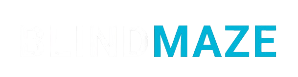

<a name="readme-top"></a>

<div align="center">

</div>

<br>
<br>

<div align="center">

[![Forks][forks-shield]][forks-url] [![Stargazers][stars-shield]][stars-url] [![Issues][issues-shield]][issues-url] [![Unlicense License][license-shield]][license-url]

<p align="center">
  <a href="https://ryuz-v.github.io/Space/" 
     target="_blank" 
     style="background-color: #c30000; color: white; padding: 10px 20px; text-decoration: none; border-radius: 5px; font-weight: bold; display: inline-block;">
     Deploy Now
  </a>
</p>
</div>

----


<br>
<p>BlindMaze is a web based maze game designed for entertainment with a simple yet challenging concept. Players are challenged to navigate a maze with visual limitations, relying on focus, logic, and exploration.</p>

<h2>Technology Used</h2>

<p>BlindMaze is built using standard web technologies:</p>

<p>
1.HTML –> Page structure and game elements

2.CSS –> Visual appearance and game styling

3.JavaScript –> Game logic, controls, and interactions
</p>
No external frameworks are used, making the code easy to understand and develop.

<h2>Installation</h2>

Clone the repository:
```bash
git clone https://github.com/Ryuz-V/BlindMaze_Game.git
cd blindmaze
```

open the `index.html` file in your Local Computer

<h2>Contribution</h2>

Contributions are open and welcome to anyone who wants to improve BlindMaze.

You can contribute by:

* Improving gameplay mechanics
* Enhancing UI/UX
* Fixing bugs
* Adding sound effects or new features

Steps to contribute:

1.Fork this repository
2.Create a new branch
3.Make your changes
4.Submit a Pull Request

<h2>License</h2>

This project is open-source and free to use for learning, modification, and further development.

**BlindMaze** — Simple Maze Game for Fun 🎮


<!-- LINK AND IMAGES -->
[forks-shield]: https://img.shields.io/github/forks/Ryuz-V/BlindMaze_Game.svg?style=for-the-badge
[forks-url]: https://github.com/Ryuz-V/BlindMaze_Game

[stars-shield]: https://img.shields.io/github/stars/Ryuz-V/BlindMaze_Game.svg?style=for-the-badge
[stars-url]: https://github.com/Ryuz-V/BlindMaze_Game/stargazers

[issues-shield]: https://img.shields.io/github/issues/Ryuz-V/BlindMaze_Game.svg?style=for-the-badge
[issues-url]: https://github.com/Ryuz-V/BlindMaze_Game/issues

[license-shield]: https://img.shields.io/github/license/Ryuz-V/BlindMaze_Game.svg?style=for-the-badge
[license-url]: https://github.com/Ryuz-V/BlindMaze_Game/blob/main/LICENSE

[Next.js]: https://img.shields.io/badge/next.js-000000?style=for-the-badge&logo=nextdotjs&logoColor=white
[Next-url]: https://nextjs.org/
[React.js]: https://img.shields.io/badge/React-20232A?style=for-the-badge&logo=react&logoColor=61DAFB
[React-url]: https://reactjs.org/
[Vue.js]: https://img.shields.io/badge/Vue.js-35495E?style=for-the-badge&logo=vuedotjs&logoColor=4FC08D
[Vue-url]: https://vuejs.org/
[Angular.io]: https://img.shields.io/badge/Angular-DD0031?style=for-the-badge&logo=angular&logoColor=white
[Angular-url]: https://angular.io/
[Svelte.dev]: https://img.shields.io/badge/Svelte-4A4A55?style=for-the-badge&logo=svelte&logoColor=FF3E00
[Svelte-url]: https://svelte.dev/
[Laravel.com]: https://img.shields.io/badge/Laravel-FF2D20?style=for-the-badge&logo=laravel&logoColor=white
[Laravel-url]: https://laravel.com
[Bootstrap.com]: https://img.shields.io/badge/Bootstrap-563D7C?style=for-the-badge&logo=bootstrap&logoColor=white
[Bootstrap-url]: https://getbootstrap.com
[JQuery.com]: https://img.shields.io/badge/jQuery-0769AD?style=for-the-badge&logo=jquery&logoColor=white
[JQuery-url]: https://jquery.com 
